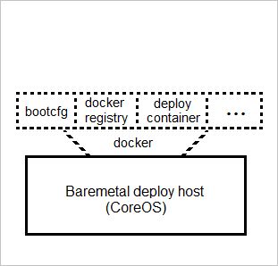
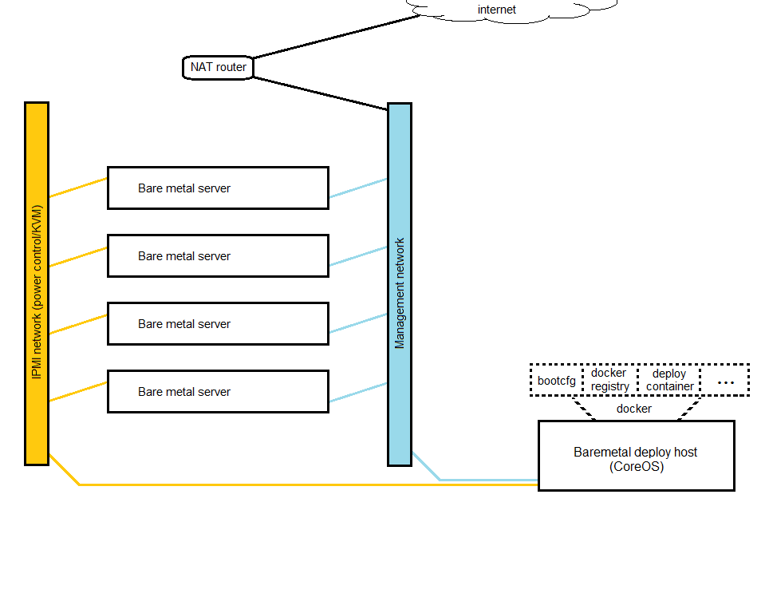

# KPC - OpenStack Kolla on PXE-booted CoreOS

### Deployment layout and supporting infrastructure
This document describes deploying Kolla to baremetal hosts running CoreOS, which have been PXE-booted from another CoreOS host (the **deploy host**).



Most of the required supporting infrastructure (CoreOS's "bootcfg" network boot service, private Docker registry, etc.) are run inside docker containers on the deploy host, including kolla-ansible. The deploy host is not technically part of the deployment and can be shut down once it is completed. However, the host should be preserved in case it is needed later for running Kolla upgrades or reconfigurations.

The deploy host runs several containerized services:
 - An instance of [CoreOS's bootcfg service](https://github.com/coreos/coreos-baremetal/blob/master/Documentation/bootcfg.md):
   - "bootcfg is an HTTP and gRPC service that renders signed Ignition configs, cloud-configs, network boot configs, and metadata to machines to create CoreOS clusters."
 - An instance of CoreOS's dnsmasq container
   - This service is deployed such that it will co-exist with an existing DHCP server which is not serving any PXE options. This is referred to as proxy DHCP: "A proxy DHCP server is defined by the PXE specification as a server which sends auxiliary boot information to clients, like the boot filename, tftp server or rootpath, but leaves the task of IP leasing to the normal DHCP server."
   - The dnsmasq service chainloads PXE clients to iPXE, network-boots CoreOS on them, and tells them to query the "bootcfg" endpoint mentioned above for their configuration. [The container image's documentation](https://github.com/coreos/coreos-baremetal/tree/master/contrib/dnsmasq) and the [coreos-baremetal documentation](https://github.com/coreos/coreos-baremetal/blob/master/Documentation/network-setup.md#proxy-dhcp) have more information on this and other operating modes (no existing DHCP, existing reconfigurable DHCP, etc.).
 - A container that is run interactively for executing kolla-ansible, build.py, etc. It is typical in Kolla that these tasks are run on a deploy host as this is the purpose of the host, but they are typically run directly on the host and not containerized. So the terminology used here will refer to this as the **deploy container**, which is run on the deploy host.

### Layout of the physical network
The vlan terminology used here is described in terms of "vlan is untagged for port" and/or "vlan is tagged for port(s)". This terminology is common on many vendor's hardware such as D-Link and Netgear, and even some midrange Cisco Business switches. It is assumed that anyone using the (arguably more traditional) access/trunk terminology will translate this reference layout to their environment.

**1. A vlan for management network**
  - This network has Internet access behind a NAT router, and is the network bare metal hosts access the Internet on.
  - The host's IP addresses on this network are how Ansible will connect to them, and Kolla's management VIP (where OpenStack management APIs will end up) is also chosen as an unused IP in this network (config option: 'kolla_internal_vip_address').
  - The NAT router handles DHCP on this network, though some devices like switches may still be statically assigned outside of the DHCP range if desired.


**2. A vlan for IPMI network.**
  - This network must not have Internet access.
  - If your hosts have dedicated IPMI NICs, the ports they plug into should be untagged on the switch for this network.
  - If your hosts have shared IPMI NICs, the ports they plug into should be untagged for the NIC's primary function (management, storage-net, etc.) and this vlan id should be set in the IPMI configs.
  - Other ports are set as tagged for this network as-needed (such as the uplink to the NAT router).
  - Assuming the case of dedicated IPMI NICs, DHCP for the IPMI network is provided by a second DHCP server on the NAT router that runs on its interface to this vlan (the test lab uses a Mikrotik RB450G). If your router cannot run both networks in this way you could instead use a second NAT router with nothing plugged in to the Internet/WAN port to provide DHCP to this network, by plugging the LAN side of the router into a port that is untagged for this network and configuring it for the correct IP range. You could also statically assign IPs to the IPMI NICs.


**3. External/provider network access**
  - At least one NIC on each host is configured to be used for external/provider network access (config option: 'kolla_external_vip_interface').


### Deploy host install

## This process involves formatting and installing to a disk or other block device. There are any number of possible ways to lose data, chief of these being choosing the wrong device to install to. Please proceed with caution.

Follow these steps to live-boot the deploy host from CoreOS ISO then install to disk:
  - Download the CoreOS ISO and burn to optical media or copy it to a USB flash drive. At last check using 'dd' should work for a flash drive, or use one of the many generic ISO to USB helper tools (Rufus [highly recommended on Windows], UNetbootin, Universal USB Installer, etc.).
    - _**IMPORTANT**_: The CoreOS version and release channel of the ISO used to boot the deploy host will be the version and channel installed on the deploy host and deployed to the nodes. Overrides for this may be added at a later date.
  - If you want the deploy host to have a predictable IP you may wish to add a static entry for it in the management network's DHCP server at this time. (If you need/want to convert a dynamic lease instead, there is no reason you can't insert a reboot after the initial key copy/SSH in order to pick up the new lease)
  - Set deployer node to boot from the disk you will install to (and double-check that), then perform a one-time boot from the ISO disc/drive to bring up a live-booted CoreOS system. It will automatically log you in as '**core**'.
  - Note the IP the deploy host gets on the management network so we can SSH to it shortly. The rest of this document assumes the address is '10.101.0.15':  
    ```
    ip a
    ```
  - Set a password for the **core** user:  
    ```
    sudo passwd core
    ```
  - Use ssh-copy-id on your computer to add the public key kolla-ansible will use to the core user's authorized_keys file (or if you lack ssh-copy-id, manually SSH in with the password from above and add the key):
    ```
    ssh-copy-id -i ./local/path/to/key.pub core@10.101.0.15
    ```
  - SSH to the host from your machine:
    ```
    ssh -i ./local/path/to/key core@10.101.0.15
    ```
  - Check out this repo:
    ```
    git clone https://github.com/ropsoft/kpc.git && cd kpc
    ```
  - Prior to running the script in the next step use `sudo fdisk -l` or similar tooling to identify the disk or block device you have set as the default boot option above and now wish to install to. Check with the upstream coreos-install script to see what is supported (for example as of this writing LVM seems unsupported by coreos-install).
    - **template-bootcfg.bash will prompt for the device name and should prompt for confirmation before wiping and installing to that device**
  - Run script to customize templates for bootcfg service and run coreos-install
    - **ALL** of the SSH keys you have added to this live-booted host (in `~/.ssh/authorized_keys`) will be added as authorized for `core` in the installed deploy host and subsequntly in the deployed nodes.
    - This script reads the SSH_CONNECTION Bash variable, so the '-E' sudo arg is required
    - This script must be run from the root of the git repo
    ```
    sudo -E ./template-bootcfg.bash
    ```

  - Reboot and SSH back in.

  - Build ipmitools and kolla_deployer containers:

    ```
    cd /etc/kpc/dockerfiles/
    docker build -t ipmitools ipmitools/
    docker build -t kolla_deployer kolla_deployer/
    cd -
    ```

  - Configure the BIOS of all target hosts to boot from the hard disk the OS will be installed to, then let the hosts idle (on "no boot media found" screen, or on their last-installed OS [assuming it wasn't running a DHCP server!], or etc.).

  - Fire up the ipmitools container:

    ```
    docker run --net=host -it ipmitools bash
    ```

  - Inside the container use ipmitool to set the hosts to boot one time from the network, then restart them. This example assumes 3 hosts and IPMI creditials of ADMIN/ADMIN, which you should substitute for your actual credentials:

    ```
    ipmi_user='ADMIN'
    ipmi_pass='ADMIN'
    
    # find hosts listening for IPMI on the IPMI network
    ipmi_targets=( $(nmap -p 623 -oG - 10.100.0.1-254 | grep 623/open | cut -d\  -f2) )

    # set to one-time PXE-boot
    for target in ${ipmi_targets[@]}; do ipmitool -H "${target}" -U "${ipmi_user}" -P "${ipmi_pass}" chassis bootdev pxe; done
    
    # reset
    for target in ${ipmi_targets[@]}; do ipmitool -H "${target}" -U "${ipmi_user}" -P "${ipmi_pass}" chassis power reset && sleep 5; done
    
    exit
    ```

  - Run the following on the deployer to start etcd in proxy mode, to get target node info that nodes have posted into etcd

    ```
    # view etcd cluster health, if desired
    etcdctl --endpoints "http://127.0.0.1:3379" cluster-health
    ```

  - Start the kolla_deployer container interactively, binding-in the Docker socket to allow for starting Docker Registry and building Kolla's container images from inside kolla_deployer.

    ```
    export DPLYR_MGMTNET_IP='10.101.10.15'  # the deploy host
    docker run -it -e "DPLYR_MGMTNET_IP=${DPLYR_MGMTNET_IP}" -v /var/run/docker.sock:/var/run/docker.sock kolla_deployer
    ```

  - The previous steps will bring you to a prompt inside kolla_deployer. Run the following commands to deploy Kolla.

    ```
    # this first command is only needed if docker commands return "client is newer than server (client API version: X.XX, server API version: Y.YY)"
    export DOCKER_API_VERSION=Y.YY  # set to client version. may be harder to fix if the server is ever newer than the client
    docker run -d -p 5000:5000 --restart=always --name registry registry:2
    kolla-build --base ubuntu --type source --threads 16 --registry "${DPLYR_MGMTNET_IP}":5000 --push
    ANSIBLE_SSH_PIPELINING=1 ansible-playbook -i /usr/local/share/kolla/ansible/inventory/ /root/ansible-coreos-bootstrap-for-kolla.yml
    # 127.0.0.1 is actually invalid here since we're inside kolla_deployer... run this one on a node or the deploy host proper
    curl http://127.0.0.1:3379/v2/keys/ansible/groupvars/coreos/ansible_ssh_user -XDELETE -d value="core"
    sed -i -e 's/^#*kolla_base_distro:.*/kolla_base_distro: "ubuntu"/' -e 's/^#*kolla_install_type:.*/kolla_install_type: "source"/' -e 's/^#*kolla_internal_vip_address:.*/kolla_internal_vip_address: "10.101.10.215"/' -e "s/^#*docker_registry:.*/docker_registry: \"${DPLYR_MGMTNET_IP}:5000\"/" /etc/kolla/globals.yml
    ANSIBLE_SSH_PIPELINING=1 kolla-ansible prechecks --inventory /usr/local/share/kolla/ansible/inventory/

    ```
